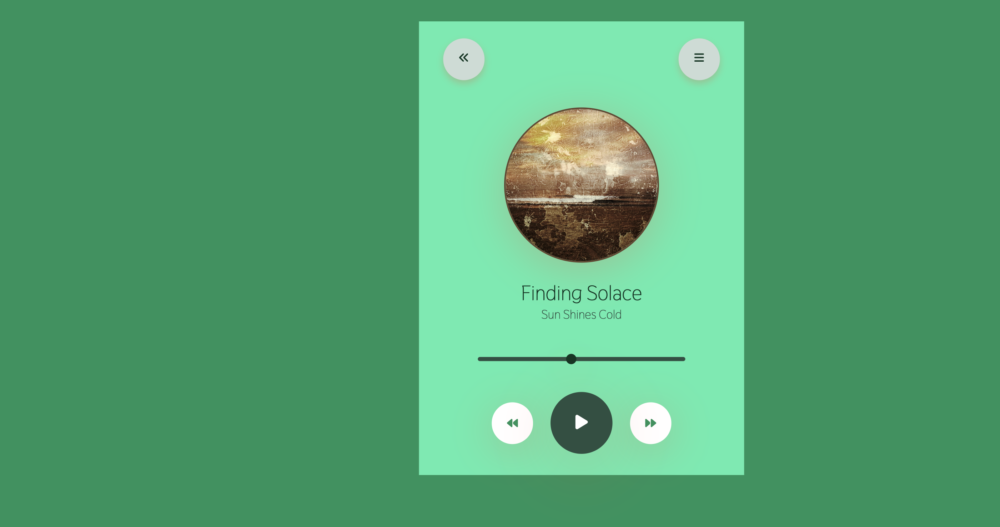

 🎧  ** Music Player Excercise ** 🎵

this exercise aimed to combine technology and creativity in a simple, user-friendly interface.

💻 Technologies Used:
HTML for structure
CSS for styling and animations
JavaScript for functionality and interactivity

🎧 Features:
Play/Pause Button: Toggle between playing and pausing your favorite tracks with just one click!
Progress Bar: Visualize your song's progress and skip to any part with the drag of a slider.

💡 work in progres:
- more features under the way... 

